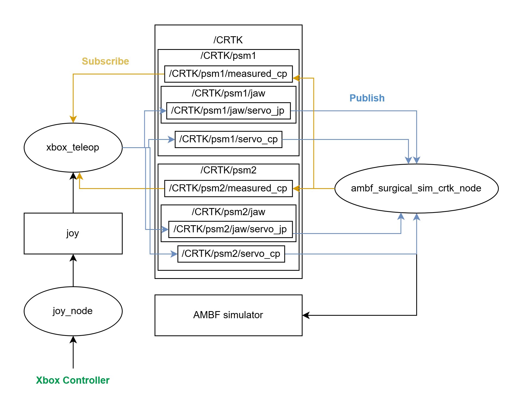

# Xbox Teleoperation for the Surgical Robotics Challenge

[](https://docs.ros.org/en/humble/)


This repository provides a ROS 2-based Xbox controller teleoperation interface for the Surgical Robotics Challenge running on AMBF 3.0. It enables Cartesian control of dual dVRK Patient Side Manipulators (PSMs) for surgical manipulation tasks such as peg transfer.

## Features
- Cartesian teleoperation of dual dVRK Patient Side Manipulators (PSMs)
- Xbox controller interface with intuitive dual-arm mapping
- Independent jaw control and pose reset
- Built on ROS 2 Humble and AMBF 3.0
- Compatible with the Surgical Robotics Challenge environments

## Demo
<p align="center">
  
</p>
Successful dual-arm peg transfer using an Xbox controller.

[Watch the full teleoperation video.](https://drive.google.com/file/d/1nw7K51ZFjbJIjIJoMCaw_GJpbm-48wjM/view?usp=sharing)

## Setup
### Requirements
- Ubuntu 22.04
- ROS 2 Humble
- [AMBF 3.0](https://github.com/WPI-AIM/ambf)
- [Surgical Robotics Challenge](https://github.com/surgical-robotics-ai/surgical_robotics_challenge)

### Installation
Clone this repository:
```bash
git clone https://github.com/LenaASu/ambf-teleop.git
```

Copy `xbox_teleop.py` into the following directory in the Surgical Robotics Challenge repository:
```
scripts/surgical_robotics_challenge/teleoperation/
```

### Troubleshooting

If object discovery fails when launching the teleoperation node in ROS 2, apply the provided patch:

```bash
git apply patches/ambf_client_ros2_discovery.patch
```

## Usage
### Launch the environment

1. Source the setup files in each new terminal:

```bash
source /opt/ros/humble/setup.bash
source ~/ros_ambf_ws/install/setup.bash 
```

2. Launch the pegboard environment:

```bash
./run_env_pegboard_asymmetric.sh
```

3. Start CRTK interface without launching the ECM:

```bash
python3 scripts/surgical_robotics_challenge/launch_crtk_interface.py --ecm False
```

4. Add Joy node:

```bash
ros2 run joy joy_node
```

5. (Optional) Check if Xbox controller is connected:

```bash
ros2 topic echo /joy
```

6. Add xbox_teleop node:

```bash
python3 scripts/surgical_robotics_challenge/teleoperation/xbox_teleop.py
```


### Xbox controller mapping
Get to know Xbox controller's sticks and buttons: [Get to know your controller](https://support.xbox.com/en-US/help/hardware-network/controller/xbox-one-wireless-controller).

| Control              | Action                |
| -------------------- | --------------------- |
| Left Stick           | Move PSM1 in X–Y      |
| LT + Left Stick      | Move PSM1 along Z     |
| LB                   | Toggle PSM1 jaw       |
| A                    | Reset PSM1 pose       |
| Right Stick          | Move PSM2 in X–Y      |
| RT + Right Stick     | Move PSM2 along Z     |
| RB                   | Toggle PSM2 jaw       |
| B                    | Reset PSM2 pose       |

## Communication Network
<p align="center">
  
</p>

The `xbox_teleop` node subscribes to Cartesian pose feedback (`measured_cp`) and publishes Cartesian pose (`servo_cp`) and jaw (`servo_jp`) commands through the CRTK interface.

## Future Work
- Rotation controller mapping
- Haptic device support

